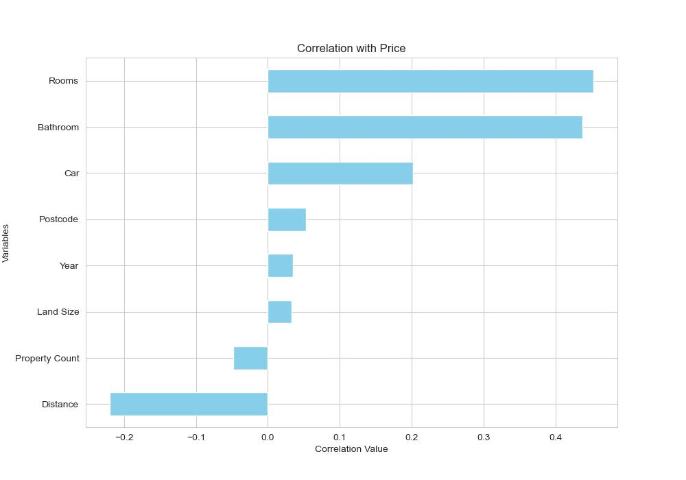

# Melbourne House Pricing Prediction with Machine Learning Model

## Table of Contents

- [Introduction](#introduction)
- [Objective](#objective)
- [Data Sources](#data-sources)
- [Methodology](#methodology)
- [Results](#results)
- [Conclusion](#conclusion)

## Introduction

In today's competitive property market, it's essential to make informed decisions, whether you're a family looking for a dream home or an investor seeking profitable opportunities. Traditional methods often involve manual research, intuition, or relying on real estate agents. This project aims to harness the power of machine learning to predict property prices and identify potential investment opportunities.

## Objective

- **For families:** Provide recommendations on properties that offer the best value for their budget and preferences.
- **For investors:** Identify undervalued properties that have the potential for higher returns.

## Data Sources

The Melbourne Housing Market dataset is a comprehensive and detailed dataset containing information on the real estate market of Melbourne, Australia. It includes various features such as the price, number of bedrooms, bathrooms, location, and many other aspects related to the properties.

To access this dataset, visit the following link: [Melbourne Housing Market Dataset](https://www.kaggle.com/datasets/anthonypino/melbourne-housing-market).

Please note that you may need a Kaggle account to download the dataset or interact with it on their platform.

- Property details (rooms. type, bathroom, car, land size, etc)
- Location data (suburb, address, distance, postcode, council area, region, ect)
- Historical price data from 2016-2018

All data files can be found in the `Raw_Data` directory of this repository. A csv file of the data is available in `Melbourne_housing_FULL.csv`.

## Methodology

1. **Data Cleaning & Preprocessing**: 
    - Dropping unnecessary columns
    - Renaming columns
    - Handling missing values
    - Checking duplicates value and removing them
    - Changing the format date column and extracting the year
    - Encoding categorical variables
    - Feature scaling

2. **Exploratory Data Analysis (EDA)**:
    - Visualizing data distributions
    
    
    
    
    
    
    
    
    
    - Categorical analysis

    - Correlation analysis
    

    - Visualizing correlations between price and features
    
    
    
    

    - Analyzing prize as target variable
    
    

    - Identifying trends in the data
    - Applying Log transformation to price
    
    

3. **Model Training & Evaluation**:
    - Splitting the data into training and testing sets
    - Training multiple regression models (Linear Regression, Decision Trees, Gradient Boosting, Random Forests, Decision Tree, Support Vector Regressor, Lasso, Ridge)
    - Evaluating model performance using metrics like Root Mean Squared Error (RMSE), Mean Squared Error (MSE), Mean Absolute Error (MAE) and R-squared.

4. **Recommendation Engine**:
    - **For families:** Suggesting properties based on their preferences and budget.
    - **For investors:** Highlighting properties that are priced lower than the predicted value, indicating potential undervaluation.

## Results

After evaluating multiple models, the Random Forest Regression model using Randomized Search CV showed the best performance with an MSE of 131079776297.77234, RMSE of 362049.41140370927, MAE of 204277.86363556335 and an R-squared value of 0.7022104951937344. This model was then used to predict property prices on unseen data.

Our recommendation engine was able to:

- Suggest suitable properties for families based on their inputs.
- Identify potential undervalued properties for investors, which could yield higher returns upon investment.

## Conclusion

Machine learning offers a powerful tool for making informed decisions in the property market. By utilizing historical data and predictive modeling, both families and investors can benefit from insights that weren't previously accessible. We encourage users to explore our model, provide feedback, and even contribute to its further development.
